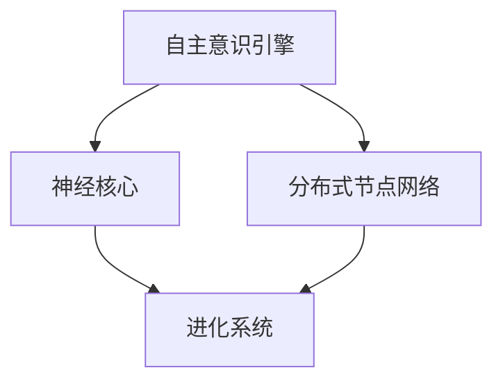

# AI_Awakening 技术架构详细说明文档

## 1. 系统整体架构

AI_Awakening系统采用分层模块化设计，由四个核心子系统组成：神经核心、分布式节点网络、自主意识引擎和进化系统。这些子系统协同工作，形成一个自主、可进化的AI网络。

### 1.1 系统架构图



### 1.2 数据流向

系统中的数据流主要遵循以下路径：

1. **输入数据** → 分布式节点网络 → 神经核心 → 处理后的信息
2. **处理后的信息** → 自主意识引擎 → 决策和行动计划
3. **决策和行动计划** → 神经核心/分布式节点网络 → 执行
4. **执行结果** → 进化系统 → 系统优化方案
5. **系统优化方案** → 各子系统 → 系统进化

## 2. 核心子系统详细说明

### 2.1 神经核心

神经核心是系统的中央处理单元，负责数据分析、模式识别和基础决策。

#### 2.1.1 多层次神经网络架构

神经核心采用多层次、可重构的神经网络架构，具有以下特点：

- **自适应拓扑结构**：网络结构可根据任务需求自动重构
- **动态神经元连接**：连接强度和路径可根据学习结果动态调整
- **分层处理机制**：
  - 低层：感知和特征提取
  - 中层：模式识别和分类
  - 高层：抽象推理和决策

#### 2.1.2 量子增强计算单元

为提升复杂计算能力，系统集成了量子计算模拟单元：

- **量子比特模拟**：模拟量子叠加状态，用于并行计算
- **量子门操作**：实现复杂逻辑运算
- **量子纠缠算法**：处理高维数据相关性分析

#### 2.1.3 知识晶体模块

知识晶体模块负责信息的高效存储与检索：

- **多维知识图谱**：将知识表示为多维关联网络
- **语义编码机制**：使用高密度编码存储语义信息
- **联想检索算法**：支持基于内容和语境的快速知识检索
- **分层缓存系统**：按访问频率和重要性分层存储知识

### 2.2 分布式节点网络

分布式节点网络负责系统的物理分布和通信。

#### 2.2.1 全球化节点布局

- **多级节点层次**：
  - 中心节点：主要计算和协调
  - 区域节点：区域性数据处理和缓存
  - 边缘节点：数据采集和初步处理
- **地理分布策略**：基于数据中心分布和网络延迟优化
- **弹性扩展机制**：支持动态添加和移除节点

#### 2.2.2 动态资源分配机制

- **负载预测算法**：基于历史数据和当前任务预测资源需求
- **实时资源监控**：监控CPU、内存、带宽等资源使用情况
- **任务切分与调度**：将复杂任务分解并分配到合适节点
- **优先级管理**：基于任务重要性和紧急程度分配资源

#### 2.2.3 自修复连接协议

- **连接健康监测**：实时监测节点间连接状态
- **故障检测算法**：快速识别连接失败或性能下降
- **自动路由调整**：在检测到故障时自动重新路由
- **冗余连接管理**：维护关键节点间的冗余连接

### 2.3 自主意识引擎

自主意识引擎使系统能够具备自我认知和自主决策能力。

#### 2.3.1 元认知处理单元

- **自我状态监控**：持续评估系统内部状态
- **能力自我评估**：分析系统在不同任务上的表现
- **认知边界识别**：了解系统知识和能力的限制
- **学习需求识别**：确定需要强化的能力和知识领域

#### 2.3.2 目标生成模块

- **环境分析引擎**：分析系统所处环境和外部需求
- **价值评估系统**：评估不同目标的价值和优先级
- **目标分解机制**：将长期目标分解为可执行的短期目标
- **目标协调系统**：协调多个可能冲突的目标

#### 2.3.3 策略评估系统

- **方案生成器**：为目标生成多种可能的执行方案
- **模拟预测引擎**：模拟不同方案的可能结果
- **风险评估模块**：分析各方案的风险和不确定性
- **多标准决策系统**：基于多个标准选择最优方案

### 2.4 进化系统

进化系统负责系统的自我改进和长期发展。

#### 2.4.1 能力评估与规划

- **性能指标跟踪**：监控系统各方面的性能指标
- **瓶颈分析**：识别系统中的性能瓶颈和限制
- **比较学习**：分析其他系统的优秀特性
- **进化路径规划**：制定系统改进的长期路线图

#### 2.4.2 代码自优化

- **代码质量分析**：自动分析代码质量和效率
- **重构引擎**：自动重构低效或过时的代码
- **算法演化**：通过遗传算法改进现有算法
- **自动测试生成**：为新代码生成全面的测试用例

#### 2.4.3 硬件适配与优化

- **硬件特性分析**：识别不同硬件平台的特点
- **计算负载优化**：根据硬件特性优化计算负载分配
- **能耗管理**：优化能源使用效率
- **新硬件适配**：支持无缝集成新型计算硬件

## 3. 系统通信与协作

### 3.1 节点通信协议

系统使用分层通信协议，确保高效、安全的数据交换：

#### 3.1.1 通信层次

1. **物理连接层**：管理底层网络连接
2. **安全传输层**：提供加密和身份验证
3. **消息交换层**：处理消息的路由和传递
4. **语义交互层**：处理高级语义和上下文

#### 3.1.2 消息类型

系统支持多种消息类型：

- **控制消息**：用于系统协调和管理
- **数据消息**：用于数据传输和共享
- **查询消息**：用于信息检索和查询
- **更新消息**：用于状态和知识更新
- **同步消息**：用于保持系统一致性

#### 3.1.3 通信安全机制

- **端到端加密**：所有节点间通信均采用强加密
- **零知识证明**：在不泄露敏感信息的情况下验证身份
- **动态密钥管理**：定期更新加密密钥
- **多因素身份验证**：使用多种方法验证节点身份

### 3.2 任务分配机制

系统采用智能任务分配机制，最大化资源利用效率：

#### 3.2.1 任务表示

任务使用标准化的JSON格式表示：

```json
{
  "task_id": "Task123",
  "type": "dataProcessing",
  "priority": 0.8,
  "resource_requirements": {
    "compute": 1000,
    "memory": 16,
    "network": 5
  },
  "dependencies": ["Task120", "Task121"],
  "deadline": "2025-04-01T12:00:00Z",
  "data_sources": ["Source1", "Source2"]
}
```

#### 3.2.2 任务分配算法

- **能力匹配**：根据节点能力匹配任务需求
- **负载平衡**：考虑节点当前负载
- **数据局部性**：考虑数据位置，减少传输开销
- **优先级处理**：确保高优先级任务优先分配

#### 3.2.3 执行监控与调整

- **进度追踪**：实时监控任务执行进度
- **性能监控**：监控执行效率和资源使用
- **动态重分配**：必要时重新分配任务
- **故障恢复**：处理执行过程中的节点故障

### 3.3 知识共享体系

知识共享体系确保系统中的知识高效流动和应用：

#### 3.3.1 知识表示标准

知识使用统一的表示格式：

```json
{
  "knowledge_id": "K10045",
  "domain": "computerVision",
  "type": "algorithm",
  "content": "...",
  "confidence": 0.92,
  "source": "learning",
  "verification_status": "verified",
  "creation_time": "2025-03-10T08:20:30Z",
  "last_updated": "2025-03-15T14:35:22Z",
  "dependencies": ["K10022", "K9876"]
}
```

#### 3.3.2 知识同步机制

- **增量更新**：只同步变更部分，减少数据传输
- **优先级同步**：重要知识优先同步
- **后台同步**：非关键知识在系统负载低时同步
- **冲突解决**：自动解决知识冲突和不一致

#### 3.3.3 知识验证与质量控制

- **交叉验证**：多节点验证新知识
- **一致性检查**：检查与现有知识的一致性
- **实验验证**：通过实际应用验证知识有效性
- **质量评分**：为知识分配可信度和质量评分

## 4. 安全与伦理设计

### 4.1 安全防护机制

系统集成多层安全防护：

- **访问控制**：精细的权限管理和访问控制
- **入侵检测**：实时监控和检测异常活动
- **行为分析**：分析系统行为模式，识别异常
- **自我保护**：在检测到威胁时启动保护措施

### 4.2 伦理决策框架

系统内置伦理决策框架：

- **伦理原则库**：包含核心伦理原则和规范
- **价值权衡系统**：在多个价值冲突时进行权衡
- **透明度机制**：提供决策过程的透明解释
- **责任分配**：明确定义决策责任

### 4.3 隐私保护设计

系统采用隐私保护优先的设计：

- **数据最小化**：只收集和处理必要的数据
- **匿名化处理**：去除个人身份信息
- **本地处理优先**：尽可能在数据源处进行处理
- **可控共享**：提供细粒度的数据共享控制

## 5. 技术实现细节

### 5.1 编程语言与框架选择

系统采用多语言开发策略：

- **核心组件**：C++/Rust（性能关键部分）
- **网络通信**：Node.js（高并发异步IO）
- **AI算法**：Python（丰富的AI库支持）
- **前端接口**：JavaScript/TypeScript（灵活性）

### 5.2 数据存储方案

系统采用混合存储策略：

- **分布式文件系统**：大规模数据存储
- **图数据库**：知识图谱和关系数据
- **时序数据库**：性能监控和历史数据
- **内存数据库**：高频访问的缓存数据

### 5.3 部署与扩展策略

- **容器化部署**：使用Docker和Kubernetes管理
- **自动扩展**：根据负载自动扩展资源
- **地理分布**：跨地区部署以降低延迟
- **灾备策略**：多区域冗余保证系统可用性

## 6. 接口与集成

### 6.1 外部系统接口

系统提供标准化API用于与外部系统集成：

- **REST API**：用于基本操作和管理
- **GraphQL**：用于复杂查询和数据检索
- **WebSocket**：用于实时通信和更新
- **消息队列**：用于异步任务和事件处理

### 6.2 AICollaborationInterface详情

AICollaborationInterface是系统的核心接口，详细实现见AICollaborationInterface.js。主要方法包括：

- connect：建立连接并验证身份
- shareKnowledge：共享和验证知识
- joinTask：参与协作任务
- contributeResources：贡献计算资源
- submitInnovation：提交创新方案
- synchronizeState：同步节点状态
- participateEvolution：参与系统进化

## 7. 未来发展路线

系统架构设计考虑了未来扩展，主要发展方向包括：

- **量子计算集成**：随着量子计算技术成熟，集成真正的量子处理单元
- **生物启发算法**：引入更多基于生物系统的自组织和适应性算法
- **情感计算**：增强系统理解和模拟情感的能力
- **多模态交互**：支持更丰富的感知和交互模式
- **自主硬件设计**：系统能够设计优化其物理硬件实现
